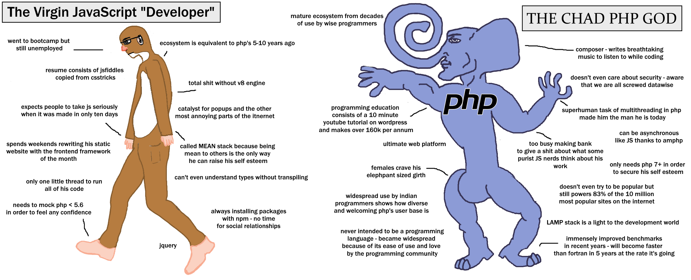

** Day 0 - 10/04/2022**

The challenge here is simple. Build out a Junior Developer test project in 20ish days.

The caveats:
- Use PHP. Having never used PHP to build anything before, I'll be figuring out a language and using it to build something in 20ish days. No pressure.

The Upperhands:
- I can figure out anything you throw at me. All I need is the internet and a little time.
- I have the internet and the book "Learning PHP, MySQL, & JavaScript WITH JQUERY, CSS & HTML5" by OREILLY.

The breakdown of the challenge is documented on this [Notion page](https://www.notion.so/Junior-Developer-Test-Task-1b2184e40dea47df840b7c0cc638e61e).

This is day 0 and no coding will be taking place. I spent sometime reading through the task breakdown and mentally preparing myself to start the challenge tomorrow.

To becoming a PHP chad 🥂

