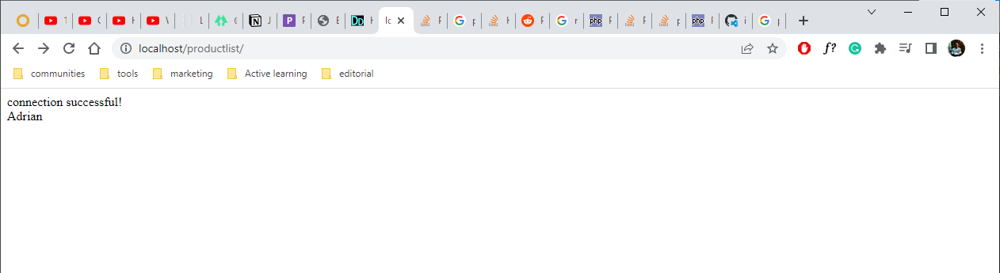

## Day 0 - 10/04/2022

The challenge here is simple. Build out a Junior Developer test project in 20ish days.

The caveats:
- Use PHP. Having never used PHP to build anything before, I'll be figuring out a language and using it to build something in 20ish days. No pressure.

The Upperhands:
- I can figure out anything you throw at me. All I need is the internet and a little time.
- I have the internet and the book "Learning PHP, MySQL, & JavaScript WITH JQUERY, CSS & HTML5" by OREILLY.

The breakdown of the challenge is documented on this [Notion page](https://www.notion.so/Junior-Developer-Test-Task-1b2184e40dea47df840b7c0cc638e61e).

This is day 0 and no coding will be taking place. I spent sometime reading through the task breakdown and mentally preparing myself to start the challenge tomorrow.

To becoming a PHP chad 🥂. Lol 😂.


## Day 1 - 11/04/2022

The first thing I'll do is figure out how to wire up PHP with a MYSQL database then deploy it.

All the testing and grading of this project will be done on a deployed site. So I think it would be wise to work with it deployed from the word go.

The main benefit of this is to pick up on any breaking changes in realtime. Work on it everyday, deploy everyday. 

For hosting I'll go with Heroku. For local development I'll go with XAMPP.

I am currently developing on windows. But I do have access to a linux environment via [WSL](https://docs.microsoft.com/en-us/windows/wsl/about). 

So I:
1. Downloaded [XAMPP](https://www.apachefriends.org/download.html)
2. Download [Heroku CLI](https://devcenter.heroku.com/articles/heroku-cli)

```php file=index.php
<?php 
echo "Hello there Heroku, Adrian here!"
?>
```

Okay so I got some output on my XAMPP server. So that's great!


I  added version control. My choice being git and everything now lives in this [git repository](https://github.com/adrianmurage/product_listing).

Using these two resources, I got the app deployed on heroku:
1. [Heroku documentation](https://devcenter.heroku.com/articles/getting-started-with-php#deploy-the-app)
2. [How to Deploy a PHP and MySQL site to Heroku and configure the database with PHPMyAdmin](https://www.doabledanny.com/Deploy-PHP-And-MySQL-to-Heroku)

The app is deployed on https://murage-product-listing.herokuapp.com/


The next step is to hook up the MYSQL database. 

After following through resource 2 under how I got the app deployed on heroku above, I hit a dead end when I tried to connect to the database from my php file. 

So I'll try switching resources and learn how to connect to a database from my OREILLY book.

From a little learning, I've figured out that the connection method on the article works for the deployed version of the app. However it does not work locally on my XAMPP server. I think figuring out how to setup env variables for local development will enable me to get it to work locally so that I don't need to keep playing with the connection string every time I need to develop locally. 

So now we learn about env varialbes in PHP 🥳🥳


I finally figured out how to add the variables. With a little help from this here [stackoverflow question](https://stackoverflow.com/questions/37570410/how-to-set-environment-variables-in-apache-xampp).

tl;dr

I created a `.htaccess` file in my folder then added in the env variable like so:

```php file=.htaccess
SetEnv CLEARDB_DATABASE_URL "get this value from the Heroku config"
```

And that got my local app working exactly like the deployed app!

Which marks the end of day 1 learning and building with PHP 🥳

The php code used to connect to the database at this level looks like this:

```php
$cleardb_url = parse_url(getenv("CLEARDB_DATABASE_URL"));
$cleardb_server = $cleardb_url["host"];
$cleardb_username = $cleardb_url["user"];
$cleardb_password = $cleardb_url["pass"];
$cleardb_db = substr($cleardb_url["path"], 1);
$active_group = 'default';
$query_builder = TRUE;
// Connect to DB
$conn = mysqli_connect($cleardb_server, $cleardb_username, $cleardb_password, $cleardb_db);

if (!$conn) {
    echo "Connection falied!";
} else {
    echo 'Connection successful!' . '<br>';
};


$query = "SELECT * FROM test_table";
$result = $conn->query($query);

$rows = $result->num_rows;

for ($i = 0; $i < $rows; ++$i) {
    $result->data_seek($i);
    echo 'First Name: ' . htmlspecialchars($result->fetch_assoc()['FirstName']) . '<br>';
}

echo "hi productlist";

```


What I accomplished today:
1. Setup a local PHP development enviroment
2. Setup a remote database and connected it to my PHP app
3. Deployed my PHP app
4. Accessed data stored in my PHP app

## Day 2 - 12/04/2022

Today's objective is to figure out where I would start when it comes to building this project.
I have a few questions that I need to answer:
1. How exactly does PHP interop with HTML and JavaScript
2. What is the difference between Procedural PHP and Object Oriented PHP
3. Understand OOP enough to be able to fix any problems that arise
4. How does one setup simple routing

HackerNoon's CEO once told me 
> "I generally try to optimize by building up smaller wins first instead of going for the big one right away"

So I'll do that here. 

One requirement for this app is that there are two distinct pages:
1. A product list page. Accessible by <your_website>/.
2. A adding product page. Accessible by: <your_website>/add-product.

Which tells me there's some routing I need to handle. About half an hour of research led me to a solution that's simple and workable for the scale of the app. 

I found this [stack overflow question](https://stackoverflow.com/questions/20960877/the-basics-of-php-routing) and the second answer gives an OOP solution to the routing issue. 

The author creates a `route.php` file with a `Route` class that handles the routing. They then include this in their `index.php` file and use an `add` method defined in the `Route` class to include specific files for each route. 

So I could use it to include a `productlist.php` as the `/` page and `addproduct.php` as the `/add-product` page. 

After adding it in, it almost immediately worked like a charm. 

I did have to do a little debugging to figure out why it wasn't working at first, and I found that this snippet was project specific to the author:

```php file=.htaccess
RewriteBase /php/cfc/
```

And removing it got the router working ✅. So win number one today.

Upon pushing to Heroku. The router was not working. My first guess was the .htaccess file. Given that I have login information to my SQL server in it, it makes it unwise to have it in version control. 

After trying to figure it out for a while, I settled on removing the sensitive information and adding the file to version control.

```php file=.htaccess

RewriteEngine On

RewriteCond %{REQUEST_FILENAME} !-f
RewriteCond %{REQUEST_FILENAME} !-d

RewriteRule ^(.+)$ index.php?uri=$1 [QSA,L]

```

But this brings me back to the part where I was trying to figure out where to put the sensitve SQL server env variable in a way that would just work. To minimize the need to keep changing the code for the local and remote envs. 

This brought me to this [stack overflow question](https://stackoverflow.com/questions/37570410/how-to-set-environment-variables-in-apache-xampp) that suggested placing them in the Apache httpd.conf file. So I tried it and it worked! I added it to the bottom of the file and restarted the server.

```php file=httpd.conf
...

SetEnv CLEARDB_DATABASE_URL "get this value from the Heroku config"

```

So now I have routing working on both my local environment and my deployed site! ✅

## Day 3 - 13/04/2022

Today I'll be working on the data. I've done a database class so I think I'll start with figuring out the structure of the data in the database then I'll go ahead and create the necessary tables. 

The values I have to consider are:
- SKU (unique for each product)
- Name
- Price in $
- Product specific attributes and their values:
    - Size (in MB) for DVD-disk
    - Weight (in Kg) for Books
    - Dimensions (HxWxL) for Furniture

I first transfered these values into table format in their Unnormalized form. 

I then identified that there are no repeating groups. Thefore the data already satisfies the 1st Normal Form requirements.

There were also no partial dependencies therefore the data was already in 2nd Normal Form.

There were however, transitive dependencies. The type of product would determine the value associated with the type. This creates an anomally where if the table were to remain as is and a product type that occured only once were deleted, the product type information would be lost. This is solved by separating the table into two. 

### Products Table

| ID        | ProductSKU       | ProductName     | ProductPrice | ProductType | ProductMeasurementValues |
| :---------| :----------------| :---------------| :------------| :-----------| :------------------------|
| 1         | JVC200123        | Acme Disk       | 1.00$        | DVD-disk    | 700                      |
| 2         | GGWP007          | War and Peace   | 20.00$       | Book        | 2                        |
| 3         | TR120555         | Chair           | 40.00$       | Furniture   | 24x45x15                 |

### Product Types Table

| ID        | TypeName  | TypeMeasurement     | TypeStandardUnit |
| :---------| :---------| :-------------------| :----------------|
| 1         | DVD-disk  | Size                | MB               |
| 2         | Book      | Weight              | Kg               |
| 3         | Furniture | Dimensions          | (HxWxL)          |

With the tables created and values added, tomorrow I'll take a stab at trying to retrieve the values and display them.

We now have the structure of the database and some sample data in the database.✅

## Day 4 - 24/04/2022

So I've been reading up on OOP over the past few days and today I'll be attempting to use classes to access the database. 

The first thing was to create a class that would help me access the database. 
I used this [OOP PHP tutorial series](https://www.youtube.com/playlist?list=PL0eyrZgxdwhypQiZnYXM7z7-OTkcMgGPh) by Dani Krossing to learn OOP. 

From his lessons, I came up with this `Dbh class` that would handle database connections. Any classes that would need access to the database would then need to extend it.

```php
class Dbh
{
    private $cleardb_url = parse_url(getenv("CLEARDB_DATABASE_URL"));
    private $cleardb_host = $this->cleardb_url["host"];
    private $cleardb_username = $this->cleardb_url["user"];
    private $cleardb_password = $this->cleardb_url["pass"];
    private $cleardb_db_name = substr($this->cleardb_url["path"], 1);

    protected function connect()
    {
        $dsn = 'mysql:host=' . $this->cleardb_host . ';dbname=' . $this->cleardb_db_name;
        $pdo = new PDO($dsn, $this->cleardb_username, $this->cleardb_password);
        $pdo->setAttribute(PDO::ATTR_DEFAULT_FETCH_MODE, PDO::FETCH_ASSOC);

        if (!$pdo) {
            echo "connection failed!";
        } else {
            echo "connection successful!" . '<br>';
        }
        return $pdo;
    }
}
```

I then created a `Test class` to try and connect to my database. 

```php
class Test extends Dbh
{
    public function getUser()
    {
        $query = "SELECT * FROM test_table";
        $result = $this->connect()->query($query);
        while($row = $result->fetch()){
            echo $row['FirstName'] . '<br>';
        }
    }
}

$connection = new Test();
$connection->getUser();
```

But on running it I got this error:

> Fatal error: Constant expression contains invalid operations in C:\xampp\htdocs\productlist\productlist.php on line 36

I then tinkered around with the values and realized that you can't declare class properties the way I had done in the `Dbh class`. From [this stack overflow question](https://stackoverflow.com/questions/24976546/calling-environment-variables-inside-class-not-working) I learnt that:

> but this initialization must be a constant value--that is, it must be able to be evaluated at compile time and must not depend on run-time information in order to be evaluated

That led me to refactoring the code to: 

```php
class Dbh
{
    private $cleardb_url = null;
    private $cleardb_host = null;
    private $cleardb_username = null;
    private $cleardb_password = null;
    private $cleardb_db_name = null;

    function __construct()
    {
        $this->cleardb_url = parse_url(getenv("CLEARDB_DATABASE_URL"));
        $this->cleardb_host = $this->cleardb_url["host"];
        $this->cleardb_username = $this->cleardb_url["user"];
        $this->cleardb_password = $this->cleardb_url["pass"];
        $this->cleardb_db_name = substr($this->cleardb_url["path"], 1);
    }

    protected function connect()
    {
        $dsn = 'mysql:host=' . $this->cleardb_host . ';dbname=' . $this->cleardb_db_name;
        $pdo = new PDO($dsn, $this->cleardb_username, $this->cleardb_password);
        $pdo->setAttribute(PDO::ATTR_DEFAULT_FETCH_MODE, PDO::FETCH_ASSOC);

        if (!$pdo) {
            echo "connection failed!";
        } else {
            echo "connection successful!" . '<br>';
        }
        return $pdo;
    }
}
```

And I had my successful connection!




I then refactored my folder structure to this:

```
├── classes
│   ├── dbh.class.php
│   ├── route.class.php
│   └── test.class.php
├── includes
│   └── classautoloader.inc.php
├── .gitignore
├── .htaccess
├── addproduct.php
├── composer.json
├── index.php
└── productlist.php
```

The `classautoloader.inc.php` file is a file that allows me to automatically load classes. 

It looks like: 
```php
<?php

spl_autoload_register('autoLoader');


function autoLoader($className)
{
    $url = $_SERVER['HTTP_HOST'] . $_SERVER['REQUEST_URI'];

    if (strpos($url, 'includes') !== false) {
        $path = '../classes/';
    } else {

        $path = "classes/";
    }
    $extension = ".class.php";


    $fullPath = $path . $className . $extension;

    if (!file_exists($fullPath)) {
        return false;
    }

    include_once $fullPath;
}
```
I learned how to implement it from [this YouTube video](https://www.youtube.com/watch?v=z3pZdmJ64jo&list=PL0eyrZgxdwhypQiZnYXM7z7-OTkcMgGPh&index=9).

The next things I plan to do are:
1. Insert into the database from a form.
2. List out items obtained from the database in a page. 

Once this is setup in as a rough draft, I will then go on to refactor it to meet the standards pointed out in the [app specification document](https://www.notion.so/Junior-Developer-Test-Task-1b2184e40dea47df840b7c0cc638e61e)


## Day 5 - 25/04/2022

Okay so the goal today is to create a form that feeds into the database. Then pull out the material and display it in a separate page. 

I'll be using my test table for this exercise. 
| FirstName | LastName | 
| :-------- | :------- | 
| Adrian    | Murage   | 
| Chris     | Maina    |

I realized that I had not deployed yesterday. So I started with that. I then found out that the autoloader I had build in to the app was not working. After about 30 ish minutes of trying to get it to work, I realized that It isn't a vital component, so I phased it out. 

In the case that I try and work on this again I'll just leave this [stackoverflow question](https://stackoverflow.com/questions/60392938/problem-with-autoloader-in-deploying-php-website-to-heroku) here because I think it might point me in the right direction.

Now that the deployed version is up to date, I'll now try and work on todays bit. 

I was able to create a form in `/add-product`:

```php
<!DOCTYPE html>
<html lang="en">

<head>
    <title>GFG- Store Data</title>
</head>

<body>
    <center>
        <h1>Storing Form data in Database</h1>
        <form action="./submitform.php" method="post">
            <p>
                <label for="firstName">First Name:</label>
                <input type="text" name="first_name" id="firstName">
            </p>
            <p>
                <label for="lastName">Last Name:</label>
                <input type="text" name="last_name" id="lastName">
            </p>
            <input type="submit" value="Submit">
        </form>
    </center>
</body>

</html>
```

On submission it calls `submitform.php` which parses the form values and commits them to the database. On completion it reroutes to the home page `/`.

To make the rerouting work I added the ENVIRONMENT variable to both my production app on heroku and my local environment. 

```php file=httpd.conf

SetEnv ENVIRONMENT "development"

```

```php file=submitform
<?php

include_once './classes/test.class.php';
include_once './classes/dbh.class.php';

$first_name = array_key_exists('first_name', $_POST) ? $_POST['first_name'] : "";
$last_name = array_key_exists('last_name', $_POST) ? $_POST['last_name'] : "";


echo $first_name; 
echo $last_name; 

$insertUser = new Test();
$insertUser->setNewUser($first_name, $last_name);

$environment = getenv("ENVIRONMENT");

if ($environment == "development"){
    header('Location:/productlist/');
} elseif ($environment == "production") {
    header('Location:/');
}

```


The home page then displays all the users:

```php
<?php

$connection = new Test();
$connection->getAllUsers();
```

Which is technically the flow required for the app. 

Fill add product form -> On submission add new product to the database -> Reroute to homepage and load the newly added product alongside all other existing products

Okay cool. Some progress. 

The next step is to figure out how to build the form according to the specification and update the function that interacts with the database to send it to its rightful table in the database. 

I'll work on that tomorrow. 